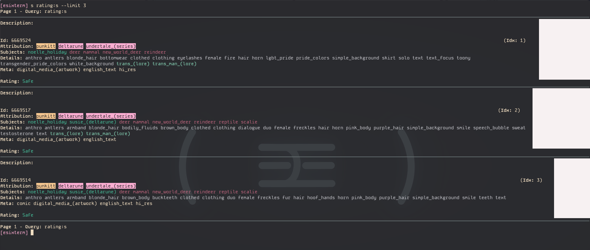
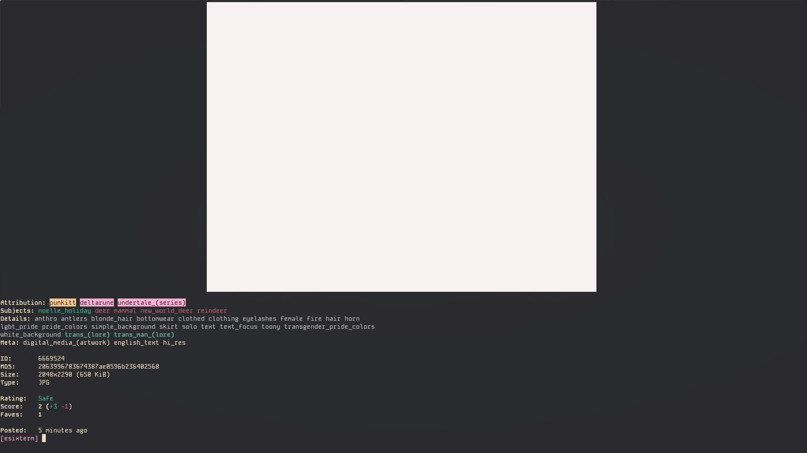
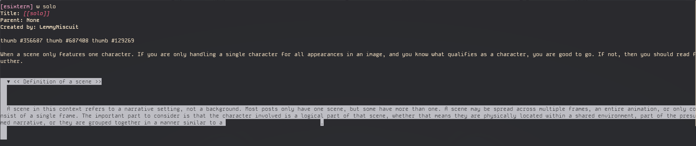

# esixterm
An e621 viewer for the terminal.

## Platform Support

|Platform|Status|
|-|-|
|Windows|Untested. (planned)|
|MacOS|Untested, but supported.|
|Linux|Supported|

## Dependencies
You may install the python dependencies needed through the following methods:
- pacman: `pacman -S python-platformdirs python-requests python-webcolors`
- pip (automatic): `pip install -r requirements.txt`
- pip (manual): `pip install platformdirs requests webcolors`

If you're on MacOS, you will also need `pyobjc`.

## Installation
Git clone this repository, or download the source code folder from a release.

Move copy or symlink the repository to `~/.local/lib/esixterm`.

Symlink the python script `esixterm` in the repository to `~/.local/bin/esixterm`. Make sure it is marked as executable.

Ensure `~/.local/bin` is on PATH.

## Configuring
Config files are automatically generated in `~/.config/esixterm`. The most relevant one being `conf.json`, which holds auth information such as `username` and `apiKey`.

These should be set if possible. `username` is your username, and `apiKey` is an api key generated at https://e621.net/api_keys. You may also find that page by going to your profile settings, going to the `Apps` tab, then clicking `API Keys`.

## Usage
Run `$ esixterm` to enter the interactive environment. Most commands runnable in the interactive environment may be ran outside the interactive environment with `$ esixterm [...]`

For example, to search in the interactive environment, you would type `[esixterm] search example_tag`. To search outside the interactive environment, you would type `$ esixterm search example_tag`.

### Keybinds:
|Keybind|Action|
|-------|------|
|`[CTRL]+[Right]`|Seek to the next page in the active search|
|`[CTRL]+[Left]`|Seek to the last page in the active search|
|`[UP]`|Seek command history (older commands)|
|`[DOWN]`|Seek command history (newer commands)|
### Interactive-only Commands
Several commands are only available in the interactive environment. They are listed here.

|Command|Action|
|-|-|
|`exit`|Closes the interactive environment.|
|`clear`|Clears the terminal and scrollback history.|

## Known Issues
|Issue|Description|Workarounds|
|-|-|-|
|[#1](https://github.com/XenithMusic/esixterm/issues/1)|Kitty images break when resizing the terminal.|`$ clear` or `[esixterm] clear`.|
|[#2](https://github.com/XenithMusic/esixterm/issues/2)|In some terminals, spoilers cannot be revealed.|Copy it and paste it elsewhere.|
|[#3](https://github.com/XenithMusic/esixterm/issues/3)|Quotes and sections look terrible. (this is because of a lack of padding)|None|
|[#4](https://github.com/XenithMusic/esixterm/issues/4)|Clipboard has poor support|Find the post on the website.|

## Gallery

||
|-|
|Search listings|
|`$ esixterm search rating:s --limit 3`|

||
|-|
|Fullscreen post viewer|
|`$ esixterm id 6669524`|

||
|-|
|Wiki viewer|
|`$ esixterm wiki solo`|

## License

This project is licensed under the GNU GPLv3 only.

## Terminal Support:

|Terminal|Support Notes|
|-|-|
|Kitty|Fully functional|
|XTerm|Affected by issue #2, and does not render images.|
|Konsole|Affected by issue #2.|